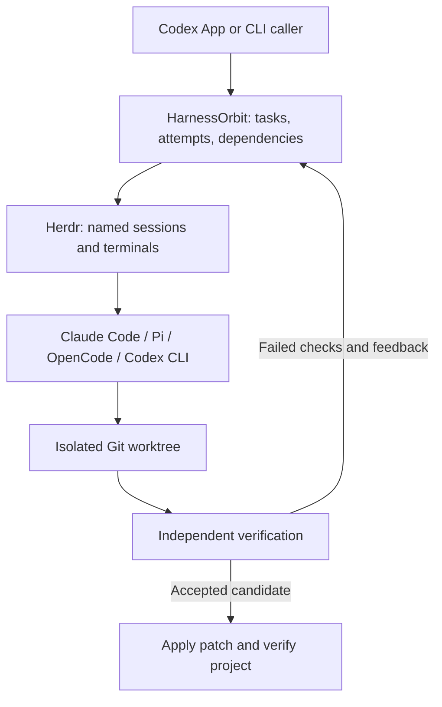

# HarnessOrbit

**AI coding agent orchestration with Herdr, Git worktrees, and independent verification.**

[](https://github.com/Snseam/harnessorbit/actions/workflows/ci.yml)
[](https://nodejs.org/)
[](LICENSE)

**English** · [简体中文](README.zh-CN.md)

[Start in Codex](#start-in-codex) · [CLI quick start](#quick-start) · [How it works](#how-it-works) · [Execution profiles](#execution-profiles) · [Agent support](#agent-support) · [Token usage](#token-usage) · [Documentation](#documentation) · [Contributing](CONTRIBUTING.md)

HarnessOrbit is a local, zero-dependency Node.js CLI for coordinating coding agents through [Herdr](https://github.com/herdrdev/herdr). Let Codex App or Codex CLI plan the work, assign scoped tasks to Claude Code or other agent sessions, and verify their changes before integrating them into your project.

> **Early preview.** The base Claude Code workflow has passed local end-to-end tests, including controlled failure and repair. Profiled execution has also been checked with Herdr 0.9+ using two Claude sessions against a local Anthropic-compatible test server. Codex and Pi profile requests have passed local mock API checks; their complete Herdr workflows and OpenCode remain unverified. Large-scale speed, quality, and cost effects have not been measured.

## Start in Codex

**Install once, then activate HarnessOrbit in any new or existing local conversation.** Codex creates the task files, delegates development, checks the results, and integrates accepted changes for you.

### 1. Copy this installation request into Codex

```text
Install the official HarnessOrbit skill for my Codex:
https://github.com/Snseam/harnessorbit

Locate an existing HarnessOrbit checkout by statting exactly these paths, in order. Do not list parent directories. Do not walk ~/.codex/sessions. Do not open jsonl or sqlite files. If a path is missing, try the next. If none exist, clone the repository into an unused, durable directory outside the target project. Preserve existing files and uncommitted changes.

1. The HarnessOrbit wrapper or checkout absolute path already recorded in this conversation's handoff notes, if any
2. $CODEX_HOME/skills/cao (only when CODEX_HOME is already set)
3. ~/.codex/skills/cao
4. ~/.agents/skills/cao

When a path exists, realpath the symlink to the checkout. Then run only:
node <absolute-checkout-path>/bin/harnessorbit.mjs skill install
node <absolute-checkout-path>/bin/harnessorbit.mjs skill status
node <absolute-checkout-path>/bin/harnessorbit.mjs doctor

Verify that Codex discovers the user skill named cao with display name HarnessOrbit. Reload the skill catalog if this existing conversation has a cached list. Report the installed path and any missing runtime prerequisites. A conflicting skill must be preserved, not overwritten.
Only install the skill at this step; I will activate it in the conversations I choose. Keep my global AGENTS.md, provider/auth settings, and other conversations' preferences intact.
```

Codex should report the installed skill path and readiness. The installation is a link to your HarnessOrbit checkout, so keep that checkout in place; updating it also updates the skill. If a required tool or an existing skill conflicts with setup, Codex reports the concrete issue.

The public product and repository are now named **HarnessOrbit** (`harnessorbit`). The installed skill keeps the internal `cao` directory and `$cao` invocation for compatibility, and the legacy `bin/cao.mjs` command remains supported. New documentation and scripts use `bin/harnessorbit.mjs`.

### 2. Activate it in the conversation you want

In **Codex App**, type:

```text
/HarnessOrbit
```

**Select the HarnessOrbit suggestion, then send the inserted skill mention.** In Codex CLI, use `$cao` or select HarnessOrbit through `/skills`. A bare, unselected `/HarnessOrbit` is not a universal CLI command.

This records HarnessOrbit as the default development workflow for **that conversation**, including an existing conversation with earlier messages. Initial defaults are two external sessions and three attempts per task; tell Codex when you want different limits or an agent/profile. Invoking HarnessOrbit again preserves your saved choices.

### 3. Describe your work normally

```text
Add CSV import to this project. Handle duplicate rows and malformed files, add regression coverage, and finish integration with passing checks.
```

You do not need to invoke HarnessOrbit again before each development request. Codex reads the conversation's saved preference and drives the HarnessOrbit workflow. Plain questions and planning requests are answered without starting workers. With no development task supplied, activation only checks readiness.

| What you want            | What to send in the same conversation                                       |
| ------------------------ | --------------------------------------------------------------------------- |
| See progress             | “Show the current HarnessOrbit mode, run, task states, and blockers.”                |
| Change the agent         | “Use my configured Pi for subsequent HarnessOrbit tasks; check compatibility first.” |
| Handle one task directly | “For this task only, work directly without HarnessOrbit.”                            |
| Turn off the default     | “Stop using HarnessOrbit by default in this conversation.”                           |
| Restore the default      | Invoke HarnessOrbit again.                                                           |

Each conversation has its own activation record. Installing the skill does not enable every conversation or create a background scheduler. To resume active work elsewhere, provide the original project, state directory, and run ID so Codex can inspect the existing run.

Development still needs Node.js 22.13+, Git, Herdr, a configured supported agent, and a Git project with at least one commit. Skill installation can succeed before all development prerequisites are ready; Codex reports those separately. See the [HarnessOrbit skill guide](docs/codex-skill.md) for install locations, updates, uninstalling, and older-client compatibility, or [manual CLI setup](#quick-start).

## Why HarnessOrbit?

- **Coordinate existing agents.** Use Herdr-managed sessions while preserving each CLI's provider and model configuration.
- **Choose execution profiles.** Route tasks to native Claude, Codex, Pi, or OpenCode profiles with local relay gateways, stored secrets, fallbacks, and capacity reservations.
- **Isolate parallel work.** Assign independent tasks separate Git worktrees, declared file ownership, dependencies, and run capacity.
- **Verify actual changes.** Check result identity and file scope, stop the worker, then run your acceptance commands against its candidate.
- **Repair with evidence.** Start a new attempt with failed check output and the previous worktree's changes intact.
- **Integrate with checks.** Detect changed target files, apply the verified patch, and rerun acceptance commands in the project checkout.
- **Keep work inspectable.** Save tasks, prompts, results, terminal output, patches, and verification logs locally.

## How it works



Codex decides what to build and how to divide the work. HarnessOrbit manages the task lifecycle; Herdr runs the interactive terminals. The selected coding agent uses the tools available in its own installation.

```text
dispatch → collect → verify → integrate
                       ↓
                     retry → collect → verify
```

Each stage is an explicit CLI command. Task submission is not completion: `collect` requires an attempt-specific result, and `verify` runs checks independently of the agent's claims.

For existing tasks, `supervise --run RUN_ID` advances collection and verification in a foreground loop. Add `--integrate` to permit patch integration and `--repair-reports` to permit one report-only repair per attempt. `performance report --run RUN_ID` shows observed phase durations and outcome coverage. See [supervision and performance](docs/supervision.md) for deadlines and recovery limits.

## Quick start

### 1. Prerequisites

- **Node.js 22.13+** and **Git**.
- [Herdr](https://github.com/herdrdev/herdr) installed and available on `PATH`.
- A supported coding agent CLI, already configured with its provider and credentials.
- A target Git repository with at least one commit.

Live agent workflows have been tested on macOS. CI checks the offline suite on macOS and Linux; that does not establish live Herdr compatibility on every platform.

### 2. Run from source

```bash
git clone https://github.com/Snseam/harnessorbit.git
cd harnessorbit
node bin/harnessorbit.mjs doctor
```

No `npm install` is needed. There is currently no published npm package.

Try a self-contained workflow with your configured Claude Code:

```bash
npm run smoke -- --live --happy
```

This creates a disposable Git project, fixes a small function in a worktree, verifies and integrates the change, then stops its Herdr session. A new directory may need a trust confirmation. If it pauses, inspect the saved run before supplying input; see [task states and recovery](docs/states.md).

### 3. Assign work in your project

Replace the example path with your target repository:

```bash
node bin/harnessorbit.mjs init --project /path/to/your-repo --id demo --max-parallel 2
mkdir -p work
```

Save the following as `work/task.json` in the HarnessOrbit checkout. This example assumes your target has `src/math.mjs` and `tests/math.test.mjs`; adapt the objective, allowed paths, and checks to your project.

```json
{
  "id": "fix-add",
  "objective": "Fix add(a, b) to return the sum. Preserve the existing API and tests.",
  "agent": "claude",
  "allowedPaths": ["src/math.mjs"],
  "checks": [
    {
      "name": "math tests",
      "argv": ["node", "--test", "tests/math.test.mjs"],
      "timeoutMs": 60000
    }
  ],
  "isolation": "worktree",
  "maxAttempts": 3,
  "maxChildren": 0
}
```

Validate and dispatch:

```bash
node bin/harnessorbit.mjs validate --file work/task.json
node bin/harnessorbit.mjs dispatch --run demo --file work/task.json
node bin/harnessorbit.mjs collect --run demo --task fix-add --wait-ms 30000
```

Check the returned state before advancing. Repeat `collect` while running; use `inspect --output` when input is needed. At `submitted`, run independent verification:

```bash
node bin/harnessorbit.mjs verify --run demo --task fix-add
```

If the result is `rework`, start a repair attempt, then collect and verify it again:

```bash
node bin/harnessorbit.mjs retry --run demo --task fix-add
```

At `accepted`, integrate the candidate. Close the run after all tasks finish or are cancelled:

```bash
node bin/harnessorbit.mjs integrate --run demo --task fix-add
node bin/harnessorbit.mjs cleanup --run demo
```

By default, commands return JSON, with errors on stderr; `--help` prints usage. State lives outside the target project, by default under `~/.local/state/harnessorbit` or `$XDG_STATE_HOME/harnessorbit`. Use the same `--state-dir` across commands and runs that coordinate one project.

## Execution profiles

For adaptive routing, you can opt into bounded preparation when no eligible resource is ready:

```bash
node bin/harnessorbit.mjs mode enable --strategy adaptive --calibration-policy on-demand --probe-budget-ms 30000
```

This saves a conversation preference. Model probes run only during a later task dispatch that needs them; an already eligible host or external agent proceeds immediately. Independently verified native task deliveries can also supply readiness without copying OAuth credentials. See [adaptive dispatch](docs/adaptive-dispatch.md) for evidence and configuration limits.

Execution profiles are optional. They let HarnessOrbit select a native agent, model, upstream endpoint, credential reference, and routing policy per task while keeping global provider files unchanged. Profiles can be authored directly or imported from a read-only CC Switch database. Stored secrets are read from stdin or environment references; secret values are never stored in profile JSON.

Useful commands:

```bash
node bin/harnessorbit.mjs profile put --file profile.json --default
printf '%s\n' "$ANTHROPIC_API_KEY" | node bin/harnessorbit.mjs secret set --id anthropic-main --stdin
node bin/harnessorbit.mjs source discover --directory ~/.cc-switch
node bin/harnessorbit.mjs profile import-cc-switch --provider claude-main --app claude --id claude-main
node bin/harnessorbit.mjs route explain --file work/task.json
node bin/harnessorbit.mjs gateway list
```

Routing supports fixed profiles and automatic `agent: "auto"` selection. A default profile is an execution selector too: if a legacy task omits `execution`, HarnessOrbit can use the default profile, including for `agent: "auto"`. With a concrete task agent, the default must still be compatible with that agent.

The first CC Switch source adapter targets schema version 18 and supports direct Claude API records from `settings_config.env` plus explicit `--allow-shared` reuse of the active Claude proxy. OAuth-only and non-Claude records are listed as unsupported rather than imported as direct profiles. See [execution profiles and routing](docs/execution-profiles.md).

## Agent Monitor

Agent Monitor is a local, read-only status page for HarnessOrbit runs and related Codex/Claude children. From a project checkout, start it with:

```bash
node bin/harnessorbit.mjs monitor start --open
```

Or ask Codex:

```text
打开当前项目Agent看板
```

When `--project`, `--run`, and `--all` are omitted, the CLI uses the current directory's Git root. The page is localhost-only, uses a URL fragment token that the browser stores in `sessionStorage`, and exposes metadata only. It does not execute commands, send input, cancel tasks, stop agents, or display prompts/tool inputs/tool outputs/model replies. `monitor stop` stops only the monitor server.

The monitor distinguishes HarnessOrbit delivery from native runtime state: a native child can be idle or finished without the HarnessOrbit attempt being `accepted`. Codex metadata prefers app-server proxy and currently falls back to local SQLite metadata when proxy is unavailable; Claude child state is strongest for new HarnessOrbit-managed attempts with private hooks and lower confidence for unmanaged local fallback. The page also has a Project view and Conversation view, and can show per-agent token metadata when native records provide it; token rows are usage observations, not plan balance, billing truth, or exact task cost. See [Local Agent Monitor](docs/monitor.md).

To inspect the current conversation view with token columns, you can ask Codex:

```text
打开当前项目Agent看板，切到当前对话并显示每个Agent Token
```

## Agent support

| Agent       | Task value | Current validation                                                                                                                                  |
| ----------- | ---------- | --------------------------------------------------------------------------------------------------------------------------------------------------- |
| Claude Code | `claude`   | Local live workflow and controlled repair verified; profiled local relay verified with a simulated Anthropic API                                    |
| Pi          | `pi`       | Isolated Kimi `k3` adaptive Herdr workflow verified through independent acceptance, integration and cleanup; other configurations remain unverified |
| OpenCode    | `opencode` | Launch and profiled runtime adapter implemented; live workflow not yet verified                                                                     |
| Codex CLI   | `codex`    | Native CLI profile request verified against a mock API; complete Herdr workflow not yet verified                                                    |

`agentArgs` forwards CLI-specific options in inherited mode. Profiled tasks reject arguments that would conflict with profile-owned model, provider, session, config, or worktree settings; Codex allows selected reasoning and verbosity `-c` overrides. `nativeInstructions` describes how a worker should use its available native tools. `maxChildren` is a reporting budget, not a hard runtime limit; adaptive Claude also checks available hook evidence before acceptance. See the [adapter architecture](docs/architecture.md), [execution profiles](docs/execution-profiles.md) and [live validation boundaries](docs/adaptive-validation.md).

## Token usage

HarnessOrbit can query local token records through the optional external Tokscale CLI. Tokscale is not a HarnessOrbit runtime dependency; install it separately if you want reports:

```bash
npm install -g @tokscale/cli@4.16.0
node bin/harnessorbit.mjs usage --today
```

Use `--tokscale-bin /path/to/tokscale` or `CAO_TOKSCALE_BIN=/path/to/tokscale` when the binary is not on `PATH`. JSON is the default output; add `--table` for a compact terminal view. Machine reports cover local records for `claude`, `codex`, `pi`, and `opencode`. Run/task reports are workspace-scoped and always set `attribution.exactTaskAttribution: false`; they do not prove exact causal task usage. HarnessOrbit calls only Tokscale local `models --json` reports, omits costs, and never calls Tokscale `submit`, `autosubmit`, `usage`, or any model. See [token usage reports](docs/usage.md).

## Verification and boundaries

- HarnessOrbit is explicitly driven by its caller; it has no background scheduler or MCP server. The local Agent Monitor can observe selected native metadata, but coverage is source-dependent and not a hard native-child telemetry guarantee.
- Worktrees and `allowedPaths` are coordination controls, not a filesystem sandbox. Ignored untracked files and external side effects are outside the Git snapshot.
- Failed integration can leave edits in the project. HarnessOrbit blocks new work for that project until recovery succeeds; `recover` rechecks the current checkout without applying the patch again.
- Direct `checkout` tasks can retain unverified edits too. Retry that task or recover after its worker stops. Shared project locks require one state directory.
- Interrupted verification fails closed and needs process/evidence inspection. `resume` does not blindly resend work or replay checks.
- HarnessOrbit does not automatically commit, push, publish, install dependencies, or change model providers.

Validation evidence includes offline tests, explicit Herdr checks, base Claude Code live scenarios, and a profiled execution smoke with Herdr 0.9+ using two Claude sessions against a local simulated Anthropic API. The profiled smoke covered separate profile model/key routing, Read/Write/Bash/tool submission, independent acceptance, 16 matched gateway requests, unchanged global provider files, and runtime release. This is functional integration evidence, not a measurement of real model quality, provider billing, or production reliability.

## Development

```bash
npm test                         # Offline tests; no agent credentials needed
npm run check                    # Syntax checks
npm run test:herdr                # Requires Herdr; does not start an agent
npm run smoke -- --live           # Controlled failure → repair → integration
```

Plain `npm run smoke` only prints instructions. Live smoke tests use your configured agent and may incur provider charges. Read [CONTRIBUTING.md](CONTRIBUTING.md) before changing runtime or recovery behavior.

## Documentation

| Resource                                                     | Contents                                                                            |
| ------------------------------------------------------------ | ----------------------------------------------------------------------------------- |
| [Architecture](docs/architecture.md)                         | CLI, state store, Herdr runtime, Git isolation, verification, profiled execution    |
| [Execution profiles and routing](docs/execution-profiles.md) | Profile CRUD, secrets, CC Switch import, routing, gateway lifecycle                 |
| [Local Agent Monitor](docs/monitor.md)                       | Read-only local dashboard for HarnessOrbit, Codex, and Claude metadata                       |
| [Task states and recovery](docs/states.md)                   | Result contract, retries, interaction, checkout and integration holds               |
| [Supervision and performance](docs/supervision.md)           | Foreground controller, preflight, report submission, deadlines and timing evidence  |
| [Resources and calibration](docs/resources.md)               | Native/NVM discovery, CC Switch Pi profiles, isolated probes and cached evidence    |
| [Task briefs and shadow routing](docs/shadow-routing.md)     | Advisory choices, conversation preferences and evidence limits                      |
| [Opt-in adaptive dispatch](docs/adaptive-dispatch.md)        | Actual resource selection, pinned attempts and native-child acceptance evidence     |
| [Paired benchmark evaluation](docs/benchmark-evaluation.md)  | Predeclared trials, complete denominators, paired outcomes and rollout limits       |
| [Adaptive live validation](docs/adaptive-validation.md)      | Tested Claude/Pi flows, isolation, observed failures and remaining coverage         |
| [Current-Codex host work](docs/host-work.md)                 | Register, report and independently verify in-place work without an external session |
| [Token usage reports](docs/usage.md)                         | Optional Tokscale integration, JSON shape, attribution boundaries                   |
| [HarnessOrbit Codex skill](docs/codex-skill.md)                       | One-prompt installation, `/HarnessOrbit` activation, conversation preferences, and updates   |
| [Changelog](CHANGELOG.md)                                    | Release history                                                                     |
| [中文文档](README.zh-CN.md)                                  | Chinese overview and getting started                                                |

## Contributing and support

Bug reports, documentation fixes, and focused pull requests are welcome. Read the [contribution guidelines](CONTRIBUTING.md) and [code of conduct](CODE_OF_CONDUCT.md), then [open an issue](https://github.com/Snseam/harnessorbit/issues/new/choose).

For security vulnerabilities, follow [SECURITY.md](SECURITY.md) and use private reporting instead of public issues.

Maintained by [Snseam](https://github.com/Snseam). HarnessOrbit is an independent project integrating with existing coding tools.

## License

[Apache License 2.0](LICENSE). Copyright 2026 Snseam. See [NOTICE](NOTICE).
