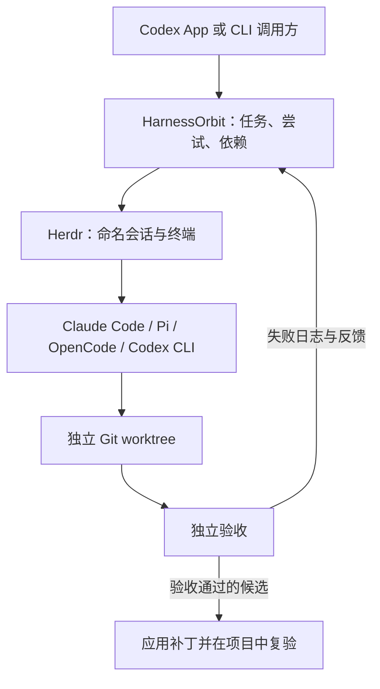

# HarnessOrbit

**基于 Herdr、Git worktree 和独立验收的 AI 编程 Agent 协调工具。**

[](https://github.com/Snseam/harnessorbit/actions/workflows/ci.yml)
[](https://nodejs.org/)
[](LICENSE)

[English](README.md) · **简体中文**

[复制到 Codex 即可开始](#在-codex-对话中直接开始) · [CLI 快速开始](#快速开始) · [工作原理](#工作原理) · [执行配置](#执行配置) · [Agent 支持](#agent-支持) · [Token 用量](#token-用量) · [文档](#文档) · [参与贡献](CONTRIBUTING.md)

HarnessOrbit是本地运行、零运行依赖的 Node.js CLI，通过 [Herdr](https://github.com/herdrdev/herdr) 协调多个编程 Agent。由 Codex App 或 Codex CLI 规划工作，将范围明确的任务分配给 Claude Code 或其他 Agent 会话，独立验收通过后再整合到项目。

> **早期预览。** 基础 Claude Code 流程已通过本机端到端测试，包含受控失败与修复。Profiled execution 也已用 Herdr 0.9+ 和两个 Claude session 针对本地 Anthropic 兼容测试服务检查。Codex 和 Pi 的原生 CLI 配置请求已通过本地模拟 API 检查；它们的完整 Herdr 流程和 OpenCode 尚未实测。大规模速度、质量和成本效果尚未测量。

## 在 Codex 对话中直接开始

**安装一次，在任意新的或已有的本地对话中启用 HarnessOrbit。** Codex 会帮你生成任务文件、分配开发工作、独立验收并整合结果。

### 1. 把下面这段话复制给 Codex

```text
请为我的 Codex 安装官方 HarnessOrbit 技能：
https://github.com/Snseam/harnessorbit

按下面顺序 stat 恰好这一条路径来定位已有 HarnessOrbit 仓库。不要列出父目录。不要遍历 ~/.codex/sessions。不要打开 jsonl 或 sqlite。路径不存在就试下一条。全部没有时，克隆到目标项目之外一个未被占用、可以长期保留的目录。保留已有文件和未提交改动。

1. 本对话 handoff 里已有的 HarnessOrbit wrapper / checkout 绝对路径（若有）
2. $CODEX_HOME/skills/cao（仅当 CODEX_HOME 已设置）
3. ~/.codex/skills/cao
4. ~/.agents/skills/cao

命中后 realpath 解析 symlink 得到 checkout，然后只执行：
node <仓库绝对路径>/bin/harnessorbit.mjs skill install
node <仓库绝对路径>/bin/harnessorbit.mjs skill status
node <仓库绝对路径>/bin/harnessorbit.mjs doctor

验证 Codex 可以发现用户技能 cao，显示名为 HarnessOrbit。若当前旧对话缓存了技能列表，刷新技能目录。报告安装位置和缺少的运行条件；遇到同名技能冲突要保留已有内容，不要覆盖。
这一步只安装技能，我会在需要的对话里单独启用。保留我的全局 AGENTS.md、提供商/认证设置和其它对话偏好。
```

Codex 会报告技能安装位置与就绪情况。技能通过链接指向你的 HarnessOrbit 仓库，因此需要保留该仓库；以后更新仓库，技能也会同步更新。工具缺失或同名技能冲突时，会说明具体原因。

公开产品和仓库现在统一使用 **HarnessOrbit**（仓库 slug 为 `harnessorbit`）。为兼容已有安装，技能内部仍保留 `cao` 目录和 `$cao` 调用，旧的 `bin/cao.mjs` 入口也继续可用；新文档和脚本统一使用 `bin/harnessorbit.mjs`。

### 2. 在你需要的对话中启用

在 **Codex App** 输入：

```text
/HarnessOrbit
```

**选择列表中的 HarnessOrbit 候选，然后发送插入的技能引用。** 在 Codex CLI 中使用 `$cao`，也可以通过 `/skills` 选择 HarnessOrbit；直接发送未经选择的裸 `/HarnessOrbit` 并不是所有 CLI 版本都支持的命令。

启用后，HarnessOrbit 成为**当前对话**后续开发任务的默认方式，已有聊天记录的旧对话同样可以启用。初始默认最多 2 个外部会话、每项任务最多 3 次尝试；直接告诉 Codex 修改限制或选择 Agent/profile。再次调用 HarnessOrbit 会保留已保存的偏好。

### 3. 后面正常提需求

```text
给这个项目添加 CSV 导入，处理重复行和格式错误，补充回归测试，完成整合并确保检查通过。
```

后续每项开发任务无需再调用 HarnessOrbit。Codex 会读取当前对话的偏好并驱动 HarnessOrbit 工作流；普通问答和方案讨论不会启动 worker。只启用、没有开发任务时，仅检查就绪情况。

| 你想做什么     | 在当前对话中发送                                     |
| -------------- | ---------------------------------------------------- |
| 查看进度       | “显示当前 HarnessOrbit 模式、run、任务状态和阻塞原因。”       |
| 更换执行 Agent | “后续 HarnessOrbit 任务使用我已经配置好的 Pi，先检查兼容性。” |
| 单次直接开发   | “仅这项任务直接开发，不使用 HarnessOrbit。”                   |
| 关闭默认方式   | “当前对话停止默认使用 HarnessOrbit。”                         |
| 再次启用       | 再调用一次 HarnessOrbit。                                     |

每个对话分别保存启用状态。安装技能不会把全部对话一起启用，也不会创建后台调度器。若要换个对话继续已有任务，请提供原项目、状态目录和 run ID，让 Codex 先检查原有运行记录。

真正开始开发仍需要 Node.js 22.13+、Git、Herdr、已配置的受支持 Agent，以及至少有一个提交的 Git 项目。技能安装和开发环境就绪会分别报告。安装位置、更新、卸载及旧客户端兼容方式见 [HarnessOrbit 技能指南](docs/zh-CN/codex-skill.md)，也可使用[手动 CLI 入门](#快速开始)。

## 为什么使用 HarnessOrbit？

- **复用已有 Agent。** 通过 Herdr 管理会话，保留各 CLI 的模型和提供商配置。
- **选择执行配置。** 将任务路由到 Claude、Codex、Pi 或 OpenCode 原生 profile，并使用本地 relay gateway、stored secret、fallback 和容量预约。
- **隔离并行工作。** 为独立任务分配 Git worktree，声明修改范围、依赖和运行容量。
- **验收实际修改。** 校验结果身份与文件范围，停止 worker 后独立执行验收命令。
- **根据证据修复。** 新尝试接收失败日志，并保留前一次 worktree 中的修改。
- **检查后再整合。** 检查目标文件是否变化，应用已验收补丁，再在项目中复验。
- **保留可检查的记录。** 本地保存任务、提示、结果、终端输出、补丁和验证日志。

## 工作原理



Codex 决定做什么、如何分工；HarnessOrbit 管理任务生命周期；Herdr 运行交互终端。被选中的 Agent 使用本机安装中实际可用的工具完成任务。

```text
dispatch → collect → verify → integrate
                       ↓
                     retry → collect → verify
```

每个阶段由明确的 CLI 命令驱动。派发成功不等于任务完成：`collect` 需要当前尝试的有效结果文件，`verify` 独立运行检查，不以 Agent 自报成功作为验收结论。

对已有任务，可用 `supervise --run RUN_ID` 在前台自动推进收集与验收；添加 `--integrate` 允许整合补丁，添加 `--repair-reports` 允许每个 attempt 一次报告补交。`performance report --run RUN_ID` 查询阶段耗时和结果覆盖。截止时间与恢复边界见[监督与性能记录](docs/zh-CN/supervision.md)。

## 快速开始

### 1. 准备环境

- **Node.js 22.13+** 和 **Git**。
- 已安装 [Herdr](https://github.com/herdrdev/herdr)，且可从 `PATH` 调用。
- 一个已配置提供商和凭证的受支持编程 Agent CLI。
- 至少包含一个 commit 的目标 Git 仓库。

真实 Agent 流程在 macOS 上实测。CI 在 macOS 和 Linux 上检查离线测试；这不代表已验证各平台上的真实 Herdr 工作流。

### 2. 从源码运行

```bash
git clone https://github.com/Snseam/harnessorbit.git
cd harnessorbit
node bin/harnessorbit.mjs doctor
```

不需要 `npm install`，目前没有发布 npm 包。

使用本机已配置的 Claude Code，运行一个独立完整示例：

```bash
npm run smoke -- --live --happy
```

脚本创建测试 Git 项目，在 worktree 中修复一个小函数，完成验收与集成，然后停止对应 Herdr 会话。首次访问目录可能需要确认信任。若脚本暂停，应先检查保存的 run，再提供具体输入，详见[任务状态与恢复](docs/zh-CN/states.md)。

### 3. 在自己的项目中分配任务

将示例路径替换为你的目标仓库：

```bash
node bin/harnessorbit.mjs init --project /path/to/your-repo --id demo --max-parallel 2
mkdir -p work
```

将下方内容保存为 HarnessOrbit 仓库中的 `work/task.json`。该例假设目标项目已有 `src/math.mjs` 和 `tests/math.test.mjs`；请按实际项目修改目标、允许路径和检查命令。

```json
{
  "id": "fix-add",
  "objective": "修复 add(a, b)，使其返回两数之和。保持现有 API 和测试不变。",
  "agent": "claude",
  "allowedPaths": ["src/math.mjs"],
  "checks": [
    {
      "name": "math tests",
      "argv": ["node", "--test", "tests/math.test.mjs"],
      "timeoutMs": 60000
    }
  ],
  "isolation": "worktree",
  "maxAttempts": 3,
  "maxChildren": 0
}
```

校验并派发任务：

```bash
node bin/harnessorbit.mjs validate --file work/task.json
node bin/harnessorbit.mjs dispatch --run demo --file work/task.json
node bin/harnessorbit.mjs collect --run demo --task fix-add --wait-ms 30000
```

根据返回状态推进流程。任务运行时继续 `collect`，需要输入时先用 `inspect --output` 查看。状态为 `submitted` 后独立验收：

```bash
node bin/harnessorbit.mjs verify --run demo --task fix-add
```

返回 `rework` 时创建修复尝试，再重新收集和验收：

```bash
node bin/harnessorbit.mjs retry --run demo --task fix-add
```

候选状态为 `accepted` 后整合补丁。所有任务完成或取消后关闭 run：

```bash
node bin/harnessorbit.mjs integrate --run demo --task fix-add
node bin/harnessorbit.mjs cleanup --run demo
```

命令默认返回 JSON，错误写入 stderr；`--help` 显示用法。状态保存在目标项目外，默认位于 `~/.local/state/harnessorbit` 或 `$XDG_STATE_HOME/harnessorbit`。协调同一项目的命令和 run 应使用相同 `--state-dir`。

## 执行配置

使用自适应路由时，可显式开启“没有可用候选时按预算补测”：

```bash
node bin/harnessorbit.mjs mode enable --strategy adaptive --calibration-policy on-demand --probe-budget-ms 30000
```

这条命令只保存当前对话偏好；后续真正派发任务且需要证据时才会运行模型探针。已有合格 host 或外部 Agent 时直接执行。独立验收后的原生任务也可提供就绪证据，无需复制 OAuth 凭据。证据与配置边界见[自适应派发](docs/zh-CN/adaptive-dispatch.md)。

Execution profile 是可选能力。它让 HarnessOrbit 为每个任务选择原生 agent、模型、上游 endpoint、凭证引用和路由策略，同时不改写全局 provider 文件。Profile 可以手写，也可以从只读 CC Switch 数据库导入。stored secret 从 stdin 或环境变量引用读取；secret 值不会写入 profile JSON。

常用命令：

```bash
node bin/harnessorbit.mjs profile put --file profile.json --default
printf '%s\n' "$ANTHROPIC_API_KEY" | node bin/harnessorbit.mjs secret set --id anthropic-main --stdin
node bin/harnessorbit.mjs source discover --directory ~/.cc-switch
node bin/harnessorbit.mjs profile import-cc-switch --provider claude-main --app claude --id claude-main
node bin/harnessorbit.mjs route explain --file work/task.json
node bin/harnessorbit.mjs gateway list
```

路由支持固定 profile 和 `agent: "auto"` 自动选择。default profile 本身也是 execution selector：旧任务省略 `execution` 时，HarnessOrbit 可以使用 default profile，包括 `agent: "auto"` 场景。若任务指定具体 agent，default 仍必须与该 agent 兼容。

第一版 CC Switch source adapter 面向 schema version 18，支持来自 `settings_config.env` 的 Claude direct API 记录，以及显式 `--allow-shared` 复用 active Claude proxy。OAuth-only 和非 Claude 记录会列为 unsupported，不会伪装成 direct profile。详见[执行配置与路由](docs/zh-CN/execution-profiles.md)。

## Agent 看板

Agent Monitor 是本地只读状态页，用于查看 HarnessOrbit runs 及关联的 Codex/Claude children。在项目 checkout 中启动：

```bash
node bin/harnessorbit.mjs monitor start --open
```

也可以告诉 Codex：

```text
打开当前项目Agent看板
```

省略 `--project`、`--run` 和 `--all` 时，CLI 使用当前目录的 Git root。页面仅绑定 localhost，URL fragment token 会自动进入浏览器 `sessionStorage`，并且只暴露 metadata。它不执行命令、不发送输入、不取消任务、不停止 agent，也不显示 prompt、tool input、tool output 或模型回复。`monitor stop` 只停止 monitor server。

看板区分 HarnessOrbit delivery 与原生 runtime state：原生 child idle/finished 不等于 HarnessOrbit attempt 已 `accepted`。Codex metadata 优先使用 app-server proxy；当前本机 proxy 不可用时会回退到本地 SQLite metadata。Claude child 状态对新 HarnessOrbit-managed private hooks 最可靠；unmanaged local fallback 置信度较低。页面还提供 Project view 与 Conversation view；当原生记录提供 token metadata 时，可以显示每个 agent 的 token 用量。Token 行只是用量观测，不是套餐余额、账单事实或某个任务的精确成本。详见[本地 Agent Monitor](docs/zh-CN/monitor.md)。

想查看当前对话视图和 token 列，可以告诉 Codex：

```text
打开当前项目Agent看板，切到当前对话并显示每个Agent Token
```

## Agent 支持

| Agent       | 任务字段值 | 当前验证情况                                                                      |
| ----------- | ---------- | --------------------------------------------------------------------------------- |
| Claude Code | `claude`   | 本机真实流程与受控失败修复已验证；profiled 本地 relay 已用模拟 Anthropic API 检查 |
| Pi          | `pi`       | 隔离的 Kimi `k3` 自适应 Herdr 流程已通过独立验收、集成和清理；其他配置仍待验证    |
| OpenCode    | `opencode` | 已实现启动与 profiled runtime 适配；真实流程待验证                                |
| Codex CLI   | `codex`    | 原生 CLI 配置请求已通过模拟 API 验证；完整 Herdr 流程待验证                       |

继承模式下 `agentArgs` 透传 CLI 启动参数。Profiled task 会拒绝与 profile 管理的模型、provider、session、config 或 worktree 设置冲突的参数；Codex 允许部分 reasoning/verbosity `-c` override。`nativeInstructions` 说明如何使用实际可用的原生工具。`maxChildren` 是报告预算，不是运行时硬限制；自适应 Claude 还会在验收前核对可用的 hook 证据。详见[适配器架构](docs/zh-CN/architecture.md)、[执行配置](docs/zh-CN/execution-profiles.md)和[真实联调边界](docs/zh-CN/adaptive-validation.md)。

## Token 用量

HarnessOrbit 可以通过可选的外部 Tokscale CLI 查询本机 token 记录。Tokscale 不是 HarnessOrbit 运行时依赖；需要报告时请单独安装：

```bash
npm install -g @tokscale/cli@4.16.0
node bin/harnessorbit.mjs usage --today
```

如果二进制不在 `PATH` 中，可使用 `--tokscale-bin /path/to/tokscale` 或 `CAO_TOKSCALE_BIN=/path/to/tokscale`。默认输出 JSON；加 `--table` 输出紧凑表格。本机报告覆盖 `claude`、`codex`、`pi`、`opencode` 的本地记录。run/task 报告是 workspace 范围，始终设置 `attribution.exactTaskAttribution: false`，不能证明精确 task 因果用量。HarnessOrbit 只调用 Tokscale 本地 `models --json` 报告，不输出金额，也不会调用 Tokscale `submit`、`autosubmit`、`usage` 或任何模型。详见 [Token 用量报告](docs/zh-CN/usage.md)。

## 验证与当前边界

- HarnessOrbit 由调用方通过 CLI 显式驱动，尚无后台调度器或 MCP 服务。本地 Agent Monitor 可以观察部分原生 metadata，但覆盖取决于 source，不等同于硬性的原生 child telemetry。
- worktree 和 `allowedPaths` 是协调机制，不是文件系统沙箱。未追踪且被忽略的文件，以及外部副作用，不在 Git 快照保证范围内。
- 集成失败可能将修改留在项目。HarnessOrbit 会阻止该项目接收新任务，直到恢复通过；`recover` 复验当前 checkout，不重复应用补丁。
- 直接使用 `checkout` 的任务也可能保留未验收修改。应重试该任务，或在 worker 停止后恢复。跨 run 的项目锁要求同一状态目录。
- 验证中断时保留阻塞状态，需要检查进程和证据；`resume` 不盲目重发任务或重跑检查。
- HarnessOrbit 不自动 commit、push、发布、安装依赖或切换模型提供商。

验证证据包括离线测试、显式 Herdr 检查、基础 Claude Code 真实场景，以及一次 profiled execution 冒烟：Herdr 0.9+、两个 Claude session、本地模拟 Anthropic API。该冒烟覆盖两个 profile 的模型/key 路由、Read/Write/Bash/提交、独立 accepted、16 个 gateway 请求匹配、全局 provider 文件未变化和 runtime 释放。这是功能集成证据，不代表真实模型质量、provider 计费或生产可靠性。

## 开发

```bash
npm test                         # 离线测试，不需要 Agent 凭证
npm run check                    # 语法检查
npm run test:herdr                # 需要本机 Herdr，不启动 Agent
npm run smoke -- --live           # 受控失败 → 修复 → 集成
```

单独运行 `npm run smoke` 只显示说明。真实冒烟测试使用你配置的 Agent，可能产生提供商费用。修改运行时或恢复逻辑前，请阅读 [CONTRIBUTING.md](CONTRIBUTING.md)。

## 文档

| 资料                                                   | 内容                                                           |
| ------------------------------------------------------ | -------------------------------------------------------------- |
| [架构与模块](docs/zh-CN/architecture.md)               | CLI、状态存储、Herdr 适配、Git 隔离、验证与 profiled execution |
| [执行配置与路由](docs/zh-CN/execution-profiles.md)     | Profile CRUD、secret、CC Switch 导入、路由、gateway 生命周期   |
| [本地 Agent Monitor](docs/zh-CN/monitor.md)            | HarnessOrbit、Codex、Claude metadata 的只读本地看板                     |
| [任务状态与恢复](docs/zh-CN/states.md)                 | 结果契约、重试、交互、checkout 与集成阻塞                      |
| [监督与性能记录](docs/zh-CN/supervision.md)            | 前台控制器、预检、报告提交、截止时间和耗时证据                 |
| [资源发现与校准](docs/zh-CN/resources.md)              | 原生/NVM 安装发现、CC Switch Pi 配置、隔离探针和缓存           |
| [任务交接与 shadow 调度](docs/zh-CN/shadow-routing.md) | 建议选择、对话偏好与证据边界                                   |
| [显式自适应派发](docs/zh-CN/adaptive-dispatch.md)      | 实际资源选择、attempt 配置绑定和原生子代理验收证据             |
| [配对基准评估](docs/zh-CN/benchmark-evaluation.md)     | 预先登记试验、完整分母、配对结果与默认上线限制                 |
| [自适应真实联调](docs/zh-CN/adaptive-validation.md)    | 已验证的 Claude/Pi 流程、隔离、实际故障与覆盖边界              |
| [当前 Codex 的 host 任务](docs/zh-CN/host-work.md)     | 不启动外部会话，登记、提交并独立验收原位修改                   |
| [Token 用量报告](docs/zh-CN/usage.md)                  | 可选 Tokscale 集成、JSON 形状与归属边界                        |
| [HarnessOrbit Codex 技能](docs/zh-CN/codex-skill.md)            | 复制指令安装、`/HarnessOrbit` 启用、对话偏好和更新                      |
| [更新日志](CHANGELOG.md)                               | 版本变化                                                       |
| [English documentation](README.md)                     | 英文概览与快速开始                                             |

## 贡献与支持

欢迎提交问题、文档修正和范围明确的 PR。请先阅读[贡献指南](CONTRIBUTING.md)和[行为准则](CODE_OF_CONDUCT.md)，再[创建 Issue](https://github.com/Snseam/harnessorbit/issues/new/choose)。

安全漏洞请按 [SECURITY.md](SECURITY.md) 私下报告，不要在公开 Issue 中披露。

由 [Snseam](https://github.com/Snseam) 维护。HarnessOrbit 是与现有编程工具集成的独立项目。

## 许可证

[Apache License 2.0](LICENSE)。Copyright 2026 Snseam。另见 [NOTICE](NOTICE)。
